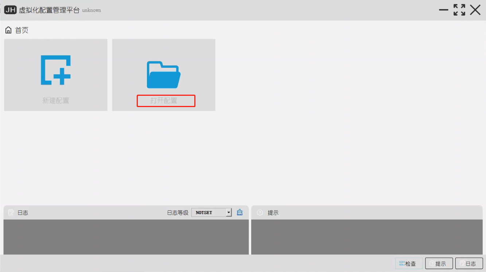
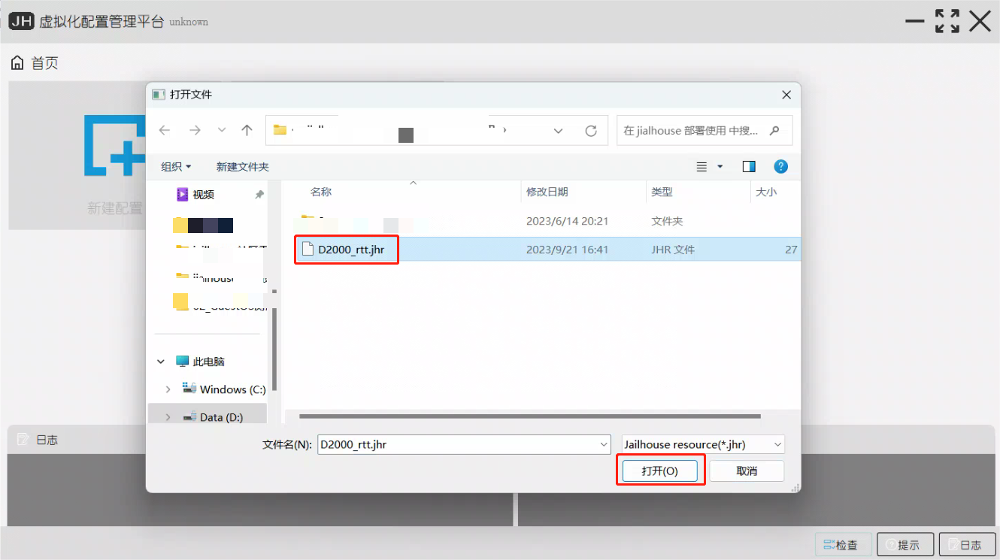
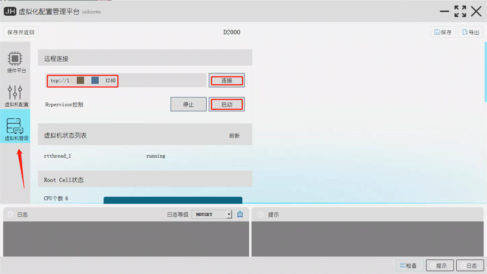
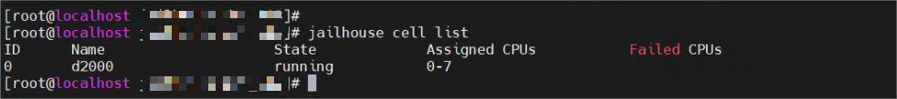
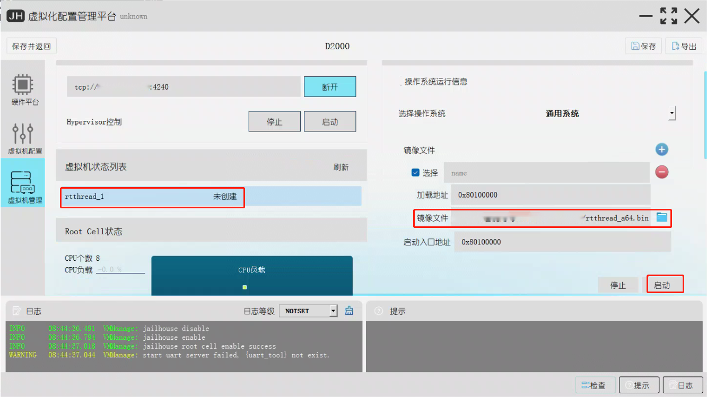
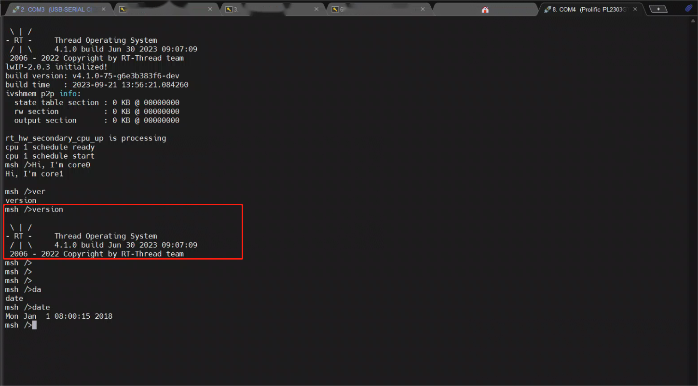

# Jailhouse-gui使用说明

## 介绍

Jailhouse-gui用于配置和管理 Jailhouse 的图形用户界面（GUI）工具，Jailhouse 是一种基于 Linux 的管理程序，可将多核处理器分割成独立单元，用于实时关键应用程序。此说明目前仅适用于openEuler边缘/服务器版本。

## 软件架构

Jailhouse-gui是一个图形界面程序，由python语言开发实现，整个软件分为两个部分，一个关注业务和数据处理的核心模块，一个是关注交互和显示的GUI模块。整个软件的功能模块架构如下图。


## 部署jailhouse虚拟化环境

### 编译Jailhouse-gui

Jailhouse-gui支持在Windows和Linux平台下运行，下面将会逐一介绍两个平台下的编译方法。

#### Linux平台下编译与打包

1、下载Jailhouse-gui的源码

```
git clone https://gitee.com/openeuler/Jailhouse-gui.git
```

2、安装Jailhouse-gui所需的依赖，依赖项在requirements_linux.txt文件中。

openEuler如果没有pip工具需要自行安装。若用户的openEuler已经安装好pip，按照下面的步骤继续执行。

```
cd Jailhouse-gui
pip install -r requirements_linux.txt -i https://pypi.tuna.tsinghua.edu.cn/simple
sudo apt install libxcb-xinerama0
```

3、对Jailhouse-gui进行打包

```
python ./build.py deploy
```

4、启动Jailhouse-gui

```
cd Jailhouse-gui/dist
./resource-tool-nonversion
```

#### Windows平台下编译与打包

1、下载Jailhouse-gui的源码。

```
git clone https://gitee.com/openeuler/Jailhouse-gui.git
```

2、安装Jailhouse-gui所需的依赖，依赖项在requirements_win.txt文件中。

```
cd Jailhouse-gui
pip install -r requirements_win.txt -i https://pypi.tuna.tsinghua.edu.cn/simple
```

3、对Jailhouse-gui进行打包。

```
python ./build.py deploy
```

4、启动Jailhouse-gui。
双击dist目录下的resource-tool可执行文件即可。

### 使用Jaillhouse-gui

为了方便用户使用Jailhouse-gui工具快速部署jailhouse虚拟化环境，我们提供了完整的配置文件和root cell和guest cell配置文件及其相关镜像文件，用户可通过jailhouse-gui工具直接使用。

提供的文件清单如下：

| 名称             | 简介                                                                                                                                                               | 路径                   |
| :--------------- | :----------------------------------------------------------------------------------------------------------------------------------------------------------------- | ---------------------- |
| D2000_rtt.jhr    | 提供一套完整的root cell和guest cell的配置条目，<br />使用Jailhouse-gui工具直接打开，通常用户不用<br />修改此配置文件。                                             | Jailhouse-gui/examlpes |
| rtthread_a64.bin | guest cell运行RTOS，rtthread_a64.bin是我们<br />提供的guest cell镜像，使用Jailhouse-gui可以<br />直接一键部署。guest cell使用的串口1，我们需<br />要提前接好串口。 | Jailhouse-gui/examlpes |

Jailhouse-gui需要和目标机上的rpc_server服务配合使用。首先需要在目标机上启动rpc_server服务。

#### 部署rpc_server服务

1、将rpc_server文件夹拷贝到目标机上。
2、安装rpc_server需要的依赖。

```
yum install -y python3-devel python3-mako
pip install zerorpc==0.6.3 psutil==5.9.4 -i https://pypi.tuna.tsinghua.edu.cn/simple
```

3、启动rpc_server，可让其后台运行。

```
cd rpc_server
python server_host.py &
```

#### 快速部署root cel

1、打开Jailhouse-gui工具后，进入主界面选择打开D2000_rtt.jhr。





2、点击"虚拟机管理"，输入目标机的IP地址，端口默认4240，无需修改，分别点击"连接"—"启动"，一键部署root cell。



3、在目标机上可以输入命令查看jailhouse 运行状态。

```
jailhouse cell list
```



#### 快速部署guest cell

部署好root cell后，就可以开始部署guest cell了，我们先接好串口1并在终端工具中打开这个串口设备。

1、在"虚拟机管理"页面中，选中"虚拟机状态列表"中的"rtthread_1"，然后镜像文件选择"rtthread_a64.bin"，其它参数无需修改，最后点击"启动"。



2、串口1中输出显示rt-thread的启动信息，并能正常使用shell命令。



## 参与贡献

1. Fork 本仓库JAILHOUSE_CONFIG_REVISION
2. 新建 Feat_xxx 分支
3. 提交代码
4. 新建 Pull Request

## 特技

1. 使用 Readme\_XXX.md 来支持不同的语言，例如 Readme\_en.md, Readme\_zh.md
2. Gitee 官方博客 [blog.gitee.com](https://blog.gitee.com)
3. 你可以 [https://gitee.com/explore](https://gitee.com/explore) 这个地址来了解 Gitee 上的优秀开源项目
4. [GVP](https://gitee.com/gvp) 全称是 Gitee 最有价值开源项目，是综合评定出的优秀开源项目
5. Gitee 官方提供的使用手册 [https://gitee.com/help](https://gitee.com/help)
6. Gitee 封面人物是一档用来展示 Gitee 会员风采的栏目 [https://gitee.com/gitee-stars/](https://gitee.com/gitee-stars/)
