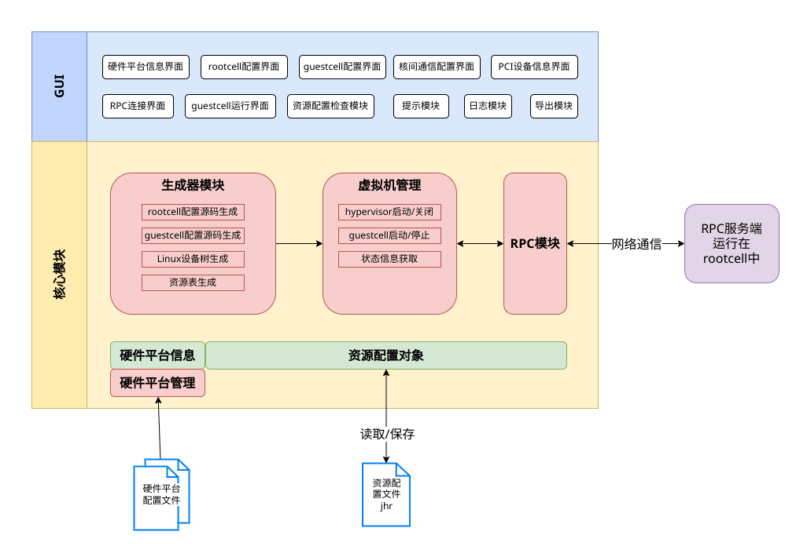

# Jailhouse-gui usage instructions

## introduce

Jailhouse gui is a graphical user interface (GUI) tool used to configure and manage Jailhouse. Jailhouse is a Linux based management program that divides multi-core processors into independent units for real-time critical applications.

## software architecture

Jailhouse gui is a graphical interface program developed and implemented in Python language. The entire software is divided into two parts: one is the core module that focuses on business and data processing, and the other is the GUI module that focuses on interaction and display. The functional module architecture of the entire software is shown in the following figure.



## Deploy jailhouse virtualization environment

### Compile Jailhouse-gui

Jailhouse gui supports running on both Windows and Linux platforms. Below, we will introduce the compilation methods for each platform one by one.

#### Compilation and packaging under Linux platform

1. Download the source code of Jailhouse gui

```
git clone  https://gitee.com/openeuler/Jailhouse-gui.git
```

2. Install the dependencies required for Jalhouse gui, which can be found in the requirements list. txt file.

If openEuler does not have the pip tool, it needs to be installed by oneself. If the user's openEuler has already installed pip, follow the steps below to continue.

```
cd Jailhouse-gui
pip install -r requirements_linux.txt -i  https://pypi.tuna.tsinghua.edu.cn/simple
sudo apt install libxcb-xinerama0
```

3. Package Jalhouse gui

```
python ./build.py deploy
```

4. Launch Jalhouse gui

```
cd Jailhouse-gui/dist
./resource-tool-nonversion
```
